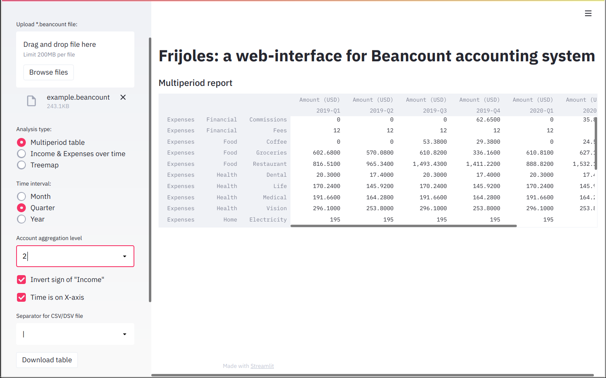
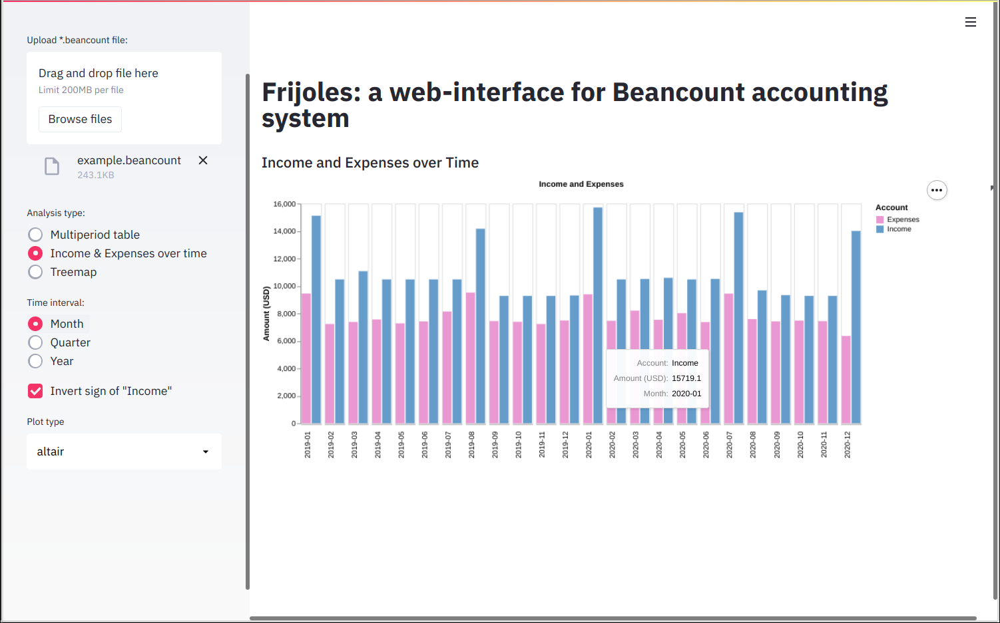
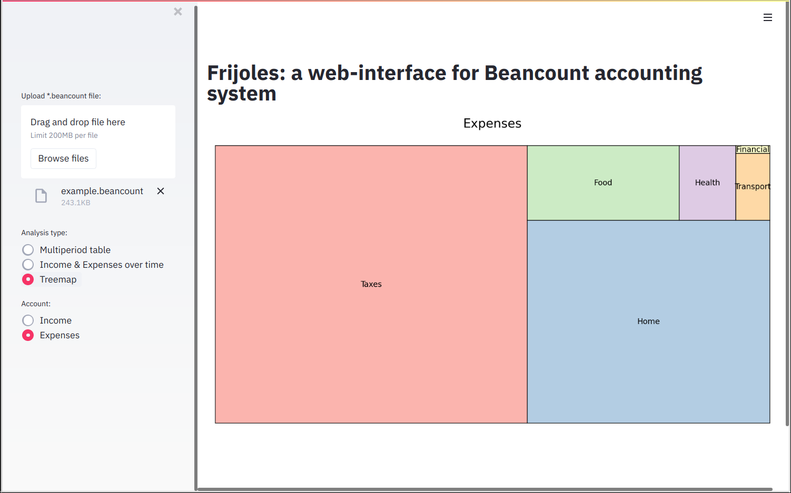
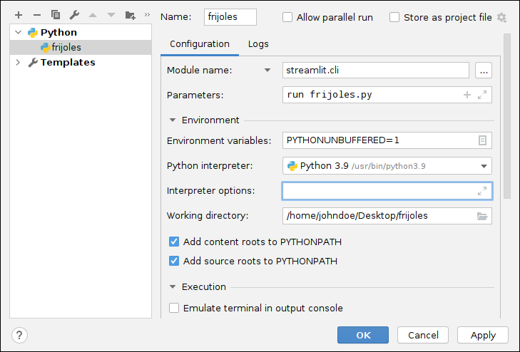

# Frijoles: a web-interface for Beancount accounting system
A simple web-interface for [Beancount](http://furius.ca/beancount/) accounting system based on [Streamlit](https://www.streamlit.io/).
The main purpose of this tool is creation and export of [hledger](https://hledger.org/)-style multiperiod reports.
Looking at earnings and spendings as a function of time can give you more insights about your finances.

The tool is based on [this blog post](https://www.isabekov.pro/multiperiod-hledger-style-reports-in-beancount-pivoting-a-table/) and Jupyter notebooks in [this repo](https://github.com/isabekov/beancount-multiperiod-reports).

## Features

- Multiperiod hledger-style reports
- Aggregation at month, quarter and year
- Aggregation at different account hierarchy level (e.g. "Expenses", "Expenses:Travel", "Expenses:Transport:Tram")
- CSV/DSV export functionality for report tables
- Plot of Income and Expenses over time
- Treemap plot of Income and Expenses (only at account hierarchy level 1)
- PNG/SVG (only for Altair graphs) export functionality for figures
- Ability to invert the sign of Income's values

## Installation and Running

    $ git clone https://github.com/isabekov/frijoles
    $ cd frijoles
    $ sudo pip install -r requirements.txt
    $ streamlit run frijoles.py
    # Open internet browser at address http://localhost:8501

## Copyright and License
Copyright (C) 2021 Altynbek Isabekov. All Rights Reserved.

This code is distributed under the terms of the "GNU GPLv2 only".

### Table View

### Income and Expenses over Time

### Treemap Plot of Expenses

## Debugging in PyCharm
Add the following run configuration and use normal debug mode:

